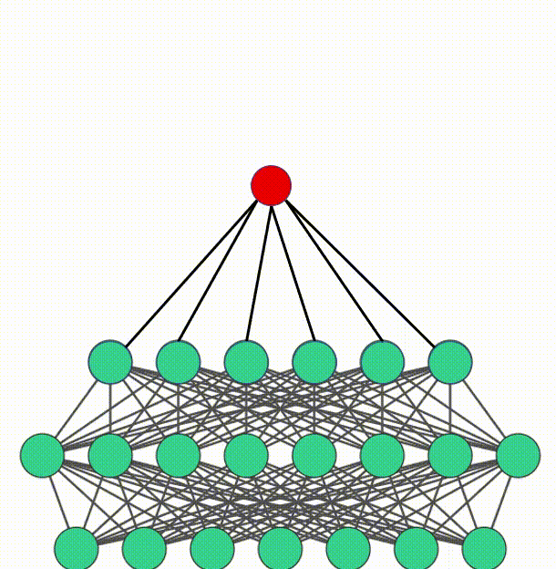

<!--

-->

      

<fieldset>
  <legend>Select a maintenance drone:</legend>

  

    <input type="radio" id="huey" name="drone" value="huey" checked />
    <label for="huey">Huey</label>
  

  

    <input type="radio" id="dewey" name="drone" value="dewey" />
    <label for="dewey">Dewey</label>
  

  

    <input type="radio" id="louie" name="drone" value="louie" />
    <label for="louie">Louie</label>
  

</fieldset>

.fieldgroup{
   float: left;
   width: auto;
   margin-left: 3em;
}

<audio controls id="audioPlayer" style="width: 100%;">
  <source src="https://archive.org/download/full_podcast1/full_podcast1b.mp3" type="audio/mpeg">
  Your browser does not support the audio element.
</audio>
<button id="rewind" onclick="rewind10sec()">Rewind 10&nbsp;s</button>
<button id="forward" onclick="forward10sec()">Forward 10&nbsp;s</button>
 
Jump to Sections:
- <a href="#" onclick="setTime(0)">00:00:00 - Background and AGI verse AI</a>  
- <a href="#" onclick="setTime(1162)">00:19:22 - Teaching importance</a>  
- <a href="#" onclick="setTime(2245)">00:37:25 - Ideas in AGI and to promote AGI</a>

   

<!--

  <em>DENN</em>
  <em>DENN</em>  
  <em>DENN</em>

      -->

  <figure style="margin: 0 0px; text-align: center;">
    <figcaption style="font-size: 18px;"><a href="https://shimon-k.github.io/publications.html#DENN">DENN</a></figcaption>
    
  </figure>
  <figure style="margin-left: 4%; text-align: center;">
    <figcaption style="font-size: 18px;"><a href="https://shimon-k.github.io/publications.html#AKREM">AKREM</a></figcaption>
        
  </figure>

  <figure style="margin-left: 0%; text-align: center;">
    <figcaption style="font-size: 18px;"><a href="https://shimon-k.github.io/publications.html#MOM">MOM</a></figcaption>
    
  </figure>

 

# About me

I'm enthusiastic About AGI. 

Check out
<!--<a style="color:#8dd3c7" href="https://shimon-k.github.io/AGI-Course/">AGI Course</a>,-->
<a style="color:#8dd3c7" href="/cv.html">Full CV</a>,
<a style="color:#8dd3c7" href="/publications.html">Publications</a>.

<!--&nbsp; &nbsp; &nbsp; &nbsp; &nbsp; &nbsp; -->My email: [cm5099@yahoo.com](mailto:cm5099@yahoo.com)

